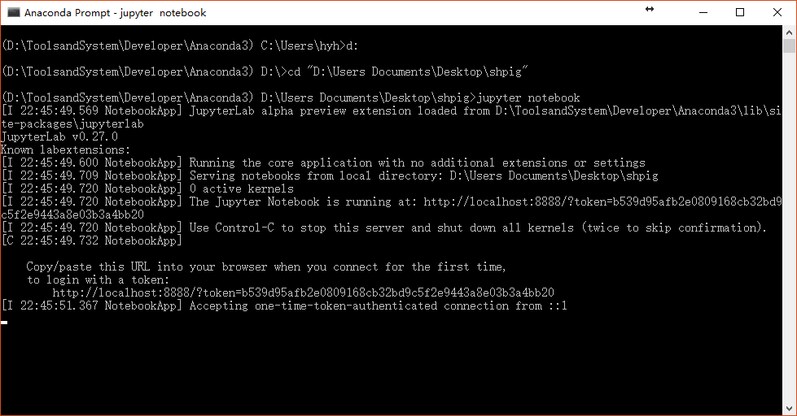

## Homework 2: Visualization and data preparation

### Tutorial: How to view a Markdown (*.md) file
In the directory of markdown file, right click in empty space, choose **Open with Code** (Visual Studio Code required), open markdown file in left sidebar (EXPLORER), then use shortcut Ctrl + Shift + V to open markdown previewer.

### Launch Jupyter Notebook
1. In start menu, open Anaconda Prompt
2. Switch path to your code directory (e.g., `cd D:\pig`)
3. Launch Jupyter Notebook with command `jupyter notebook`

4. Open `plot.ipynb` to continue your homework


## Extra Homework Ⅰ: Code pythonicly
Python has its own [code style](https://www.python.org/dev/peps/pep-0008/). So-called *Pythonic* code is the code in Python code style. A pythonic code includes 2 parts:

One is format style. For example, two blank lines are required between two method definition:
```python
# correct
def foo():
    pass


def foobar():
    pass
```
```python
# wrong
def foo():
    pass
def foobar():
    pass
```

Thanks to PyCharm, you no longer need to read boring offical documentation in code style. PyCharm offers a powerful formatting tools for you to format your code automatically. What you need to do is just press **`Alt + F8`**, then your code will be formatted in standard python style. Remember **`Alt + Enter`** is also your friend when your code is underlined.

The other one is code style. For example, you do something like this in *C-like* programming language when you change the value of two variables `a` and `b`:
```c
int temp = a;
a = b;
b = temp;
```
The pythonic code only needs one line:
```python
b, a = a, b
```

In this extra homework, you are required to use `Alt + Enter` and `Alt + F8` to clean your code when PyCharm underline your future code. **Try to avoid wavelines in your code.**

## Homework 3: Predict!
In this homework, you are required to **predict the piggy price** on Shanghai Piggy Dataset. The tool will be used is `scikit-learn`, or `sklearn`. 

To simplify the model, **Linear Regression** will be applied to the dataset. Feel free to explore any complex model although I believe you will not.

<script type="text/javascript" src="http://cdn.mathjax.org/mathjax/latest/MathJax.js?config=default"></script>

Here is an [example](http://scikit-learn.org/stable/modules/linear_model.html#ridge-regression) to fit a linear function $f(x)=\frac{1}{2}x$

```python
from sklearn import linear_model
import numpy as np

reg = linear_model.Ridge()
x = np.arange(1e3)
y = 0.5 * x
x = x.reshape(-1, 1) # the parameter x of the fit method should be an 2-d array
reg.fit(x, y)
print(reg.coef_)
# expected output should be:
# [ 0.49999999]

```

Related reference:
- [sklearn.linear_model.LinearRegression.fit](http://scikit-learn.org/stable/modules/generated/sklearn.linear_model.LinearRegression.html#sklearn.linear_model.LinearRegression.fit)